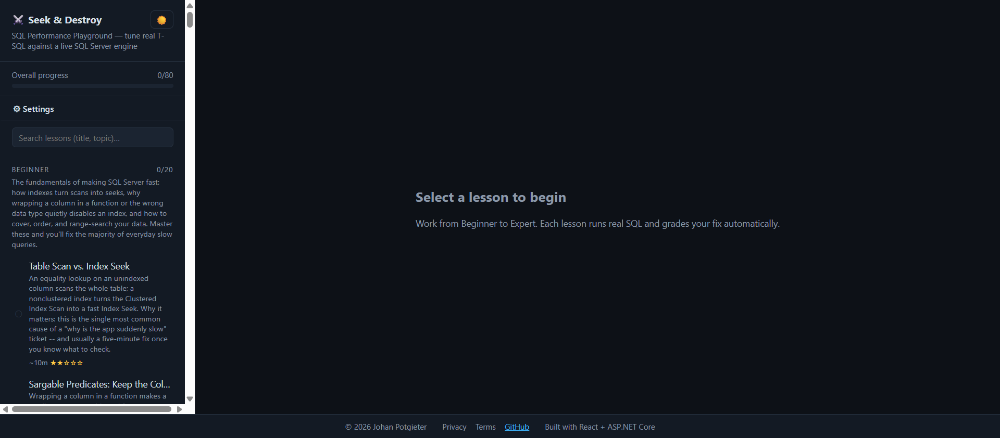
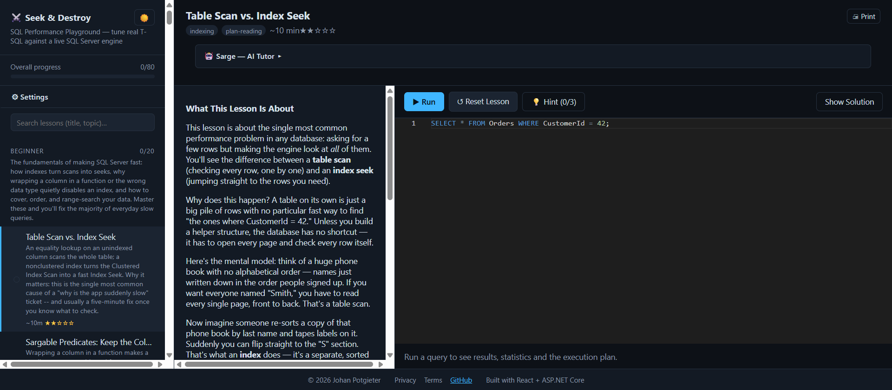

# 🗄️ CCS SQL Academy — a SQL Performance & Database Design Playground

[](https://github.com/johanccs/ccs-sql-academy/actions/workflows/ci.yml)

**Repo:** https://github.com/johanccs/ccs-sql-academy

**Live:** https://salmon-field-04fa1fd10.7.azurestaticapps.net (API: https://seek-and-destroy-api.azurewebsites.net)
— running on Azure SQL Database + App Service + Static Web Apps.

> ## 🚧 Work in progress
>
> This app is still being built and is **not finished**. Some features may not work yet,
> and others will change.
>
> - The **SQL Performance** track is complete — all 80 lessons work end to end.
> - The **Database Design** track is new: **10 of 35 modules** are written so far — the
>   Beginner level is complete. The rest appear on the roadmap page but are not clickable yet.
> - The design track's ERD canvas is mouse-only — no touch support.
> - The hosted API sleeps when idle, so the first request after a quiet spell can take
>   several seconds.
>
> Bug reports and suggestions are welcome.

An interactive, web-based playground for developing **Microsoft SQL Server performance-tuning**
skills — from beginner to expert. You write real T-SQL against a **real SQL Server 2022 engine**,
see genuine execution plans, `STATISTICS IO/TIME`, locking and deadlocks, and each lesson grades
your fix automatically.

This is a learning tool for query performance (indexes, bad query patterns, plan reading,
blocking/deadlocks, tempdb pressure, statistics/caching) — **not** a SQL-syntax tutorial.




## Architecture

Three containers, orchestrated by `docker-compose.yml`:

| Service     | What it is                        | Host port |
|-------------|-----------------------------------|-----------|
| `sqlserver` | SQL Server 2022 (lesson DBs + `AppMeta` progress DB) | 14330 → 1433 |
| `api`       | ASP.NET Core (C#) — runs your SQL, captures plan+stats, grades pass conditions, drives scripted deadlock demos | 5080 → 8080 |
| `web`       | React SPA (Monaco editor, graphical plan viewer, stats dashboard, deadlock timeline) | 5173 → 80 |

See [`docs/CONTRACT.md`](docs/CONTRACT.md) for the full API + lesson-manifest specification.

## Quick start

```bash
cp .env.example .env          # optional: change the SA password
docker compose up --build
```

Then open **http://localhost:5173**.

The API seeds each lesson's database on first access and creates the `AppMeta` progress
database automatically. Progress persists across restarts (stored in `AppMeta`).

## How a lesson works

1. Pick a lesson from the sidebar (grouped Beginner → Expert).
2. Read the scenario, run the deliberately-slow **starting query**, and inspect the
   **Execution Plan** and **Statistics** tabs.
3. Improve it — add an index, rewrite the query, update statistics, reorder a transaction…
4. Re-run. The **pass/fail banner** shows exactly which measurable conditions you've met
   (e.g. *no Table Scan*, *logical reads < 200*, *Index Seek used*).
5. **Reset Lesson** restores the original slow state at any time.

**Concurrency lessons** (blocking/deadlocks) show two editable session scripts; the API runs
them as two real interleaved connections server-side and streams back a timeline showing who
blocked whom and which session was chosen as the deadlock victim.

## Curriculum

~20 lessons per level across four levels (~80 total), covering: indexing (missing/unused/
covering/filtered), sargability & query rewriting, join algorithms, execution-plan reading,
blocking & deadlocks, tempdb spills & contention, statistics staleness & cardinality
estimation, parameter sniffing & plan cache, isolation levels & lock escalation, parallelism,
columnstore, and holistic real-world case studies.

Lessons live under `lessons/<level>/<id>/` as `manifest.json` + `seed.sql` + `solution.sql`.
Adding a lesson is pure content — no code changes — following the schema in `docs/CONTRACT.md`.

## Repo layout

```
docker-compose.yml     three-service orchestration
docs/CONTRACT.md       authoritative API + manifest spec
lessons/               lesson content (data + manifests)
api/SqlPerf.Api/       ASP.NET Core Web API
web/                   React + Vite SPA
```

## Local development (without Docker)

- **API:** `cd api/SqlPerf.Api && dotnet run` (set `ConnectionStrings__Sql` to your SQL Server,
  e.g. `Server=localhost,14330;User Id=sa;Password=...;TrustServerCertificate=True;`).
- **Web:** `cd web && npm install && npm run dev` (reads `VITE_API_BASE`, default
  `http://localhost:5080`).

> Note: the SPA loads the Monaco editor engine from a CDN at runtime, so first load needs
> internet access.

## Settings & disaster recovery

The app has a **Settings** page (⚙ in the sidebar) for environment status and database
administration — no manual SQL scripts required day-to-day:

- **Reset All Lesson Databases** — re-runs every lesson's `seed.sql`, recreating all 80
  lesson databases from scratch. Use after a fresh install or after the SQL container's
  data volume was recreated.
- **Reset My Progress** — clears recorded lesson-completion progress (`AppMeta` DB).
- **Recreate SQL Server Container** — full disaster recovery, run with one click: deletes
  the `sqlperf-sqlserver` container and image, pulls a fresh SQL Server 2022 image,
  recreates the container via `docker compose`, waits for it to become healthy, then
  reseeds every lesson database automatically.

**How the one-click container recreate works:** the `api` container has the **host's Docker
socket** (`/var/run/docker.sock`) and the project directory bind-mounted in (see
`docker-compose.yml`), plus the Docker CLI and Compose plugin installed (see
`api/Dockerfile`). This lets it run `docker`/`docker compose` commands against the host's
Docker daemon directly (the "Docker-outside-of-Docker" pattern) — no separate orchestration
tool needed.

> ⚠️ **Security note:** mounting the Docker socket gives the `api` container full control
> of the **host's** Docker daemon (equivalent to root on the host). This is appropriate for
> a trusted local/dev machine only. **Never enable this mount in a shared or
> internet-facing deployment** (including the Azure deployment below) — remove the
> `docker.sock`/`.:/workspace` volume mounts from the `api` service, and rely on the
> standalone scripts (`scripts/recreate-sql-container.ps1` / `.sh`) or your platform's own
> redeploy mechanism instead. The Settings page's fallback instructions cover this.

If the API can't reach Docker (socket not mounted, remote host, etc.), run the equivalent
script yourself from the project root:

```bash
# Windows (PowerShell)
./scripts/recreate-sql-container.ps1

# macOS / Linux
./scripts/recreate-sql-container.sh
```

## Deploying to Azure

**Live deployment:** https://salmon-field-04fa1fd10.7.azurestaticapps.net (South Africa North).
Total cost: **~$5/month** (see below).

### Architecture

All 80 lessons share **one Azure SQL Database** (free tier), isolated by SQL schema + a
contained `EXECUTE AS` user per lesson (see `SqlExecutor.cs`) instead of one database per
lesson — this is what makes the free tier viable (Azure SQL's free tier is one database per
tenant, not a pool). No Docker/containers are involved in the Azure path at all:

| Component | Azure resource | Cost |
|---|---|---|
| SQL Server | **Azure SQL Database**, General Purpose Serverless, `--use-free-limit` | **$0/mo** (genuinely free, not a trial) |
| API | **App Service** (Linux, B1), native `dotnet publish` deploy — no container | ~$13/mo *(F1 free tier also works but its 60 CPU-min/day cap makes bulk operations time out)* |
| Web SPA | **Static Web Apps** (free tier) — a Vite build is just static files; no nginx container needed | $0/mo |

Local dev keeps using Docker Compose (three containers, one database per lesson) unchanged —
the schema-per-lesson model works identically in both places, only the *connection string*
and *lesson count per HTTP request* differ.

### Deploy steps (what was actually run)

```bash
# Resource group
az group create -n <resource-group> -l <region>

# SQL: logical server + free-tier database
az sql server create -n <sql-server> -g <resource-group> -l <region> \
  --admin-user <admin-user> --admin-password <password>
az sql db create -g <resource-group> -s <sql-server> -n <db-name> \
  -e GeneralPurpose -f Gen5 -c 2 --compute-model Serverless \
  --use-free-limit --free-limit-exhaustion-behavior AutoPause
az sql server firewall-rule create -g <resource-group> -s <sql-server> \
  -n AllowAzureServices --start-ip-address 0.0.0.0 --end-ip-address 0.0.0.0

# API: App Service, native .NET deploy (no Docker)
az appservice plan create -n <app-service-plan> -g <resource-group> -l <region> --is-linux --sku B1
az webapp create -n <api-app> -g <resource-group> -p <app-service-plan> --runtime "DOTNETCORE:10.0"
az webapp config appsettings set -n <api-app> -g <resource-group> --settings \
  "ConnectionStrings__Sql=Server=tcp:<sql-server>.database.windows.net,1433;Initial Catalog=<db-name>;User ID=<admin-user>;Password=<password>;Encrypt=True;TrustServerCertificate=False;" \
  "Sql__AppDatabase=<db-name>" \
  "Lessons__Path=/home/site/wwwroot/lessons"
dotnet publish api/SqlPerf.Api -c Release -o ./publish
cp -r lessons ./publish/lessons          # lesson content ships inside the deployed app
# zip ./publish and:
az webapp deploy -n <api-app> -g <resource-group> --src-path deploy.zip --type zip

# Web: Static Web Apps, built with the API's real URL baked in
az staticwebapp create -n <web-app> -g <resource-group> -l <region>
docker build --build-arg VITE_API_BASE=https://<api-app>.azurewebsites.net --target build -t web-build ./web
docker create --name extract web-build && docker cp extract:/app/dist ./dist_deploy && docker rm extract
npx @azure/static-web-apps-cli deploy ./dist_deploy --deployment-token <token> --env production
```

### Gotchas hit during deployment (already fixed in code)

- **`CREATE DATABASE` must be the only statement in its batch on Azure SQL** — an
  `IF DB_ID(...) IS NULL CREATE DATABASE ...` conditional (fine on-prem) fails there.
  `ProgressStore` checks existence via a separate `SELECT` first.
- **`DB_ID(name)` on Azure SQL only resolves the *currently connected* database** —
  returns `NULL` for any other database on the same server even when it exists. Query
  `sys.databases` directly instead.
- **The bulk "Reset All Lesson Databases" Settings action will 504 on Azure** — resetting
  all 80 lessons sequentially in one HTTP request (~7s each, ~10 minutes total) exceeds
  App Service's gateway timeout. Individual lesson resets (what the app actually uses
  day-to-day) are fast (~2-7s) and unaffected. This is a platform request-timeout limit,
  not a region/tier problem — it works fine locally (no gateway in front of Kestrel there).
- **Region matters for latency**, not just cost — if you're geographically far from a
  region, cumulative round-trip latency across many sequential DB calls (seeding, resets)
  adds up fast. Deploy close to where you'll actually use it.

## Attribution

Built and maintained by **CCS**. © 2026 CCS.
