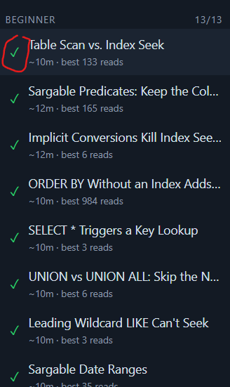

** Context
1. I need an application to learn and develop my sql performance skills
2. You are an sql expert on professor level

** Instructions
1. Develop and application that can serve as a playground to improve my sql PERFORMANCE skills
2. I do not at this stage need training in sql statements.
3. Should have levels from beginner to expert
4. Create the lesson from your own experience.
5. Test on things like indexes, badly written sql statements, dead-locks, long running queries, temp db issues and whatever I need to know about performance tuning.
6. Should be professional. Web based and not only text that I must read. Must be interactive where I can enter sql statements and see the improvements using statistics. 
7. simulate missing or unused index scenarios. Simulate test plans and caching. 
8. Start from beginner to advanced level. Do not make any assumptions.
9. Base the course on microsoft sql server 
10. Test using real world scenarios
11. Make a comprehensive course - multiple lessons in each sections to enhance the learning experience.

** More instructions
1. The quality must be on the same level as https://sqlmaestros.com/all-in-one-bundle/.
2. Reach out on the internet to verify the content is of best quality
3. Add a AI chatbot to to allow users to ask questions about a specific topic. Ai must be context aware.
4. If AI have explananation - if diagrams can be used it must be well formatted svg diagrams
5. All the lessons are marked as completed which I haven't done yet-      
6. In lessons needed - do you explain and simulate execution plan and does it look like sql servers's
7. Add a db create script and seed scripts in case the docker image gets deleted - add a menu item called settings.
Then add a ui to setup the db programmatically instead of letting the user run scripts manually. 
These should include a script to delete the sql container and image and then pull a new image and create 
a container.
8. Add a comprehensive description to each lesson so that I know what the lesson and section is about.
